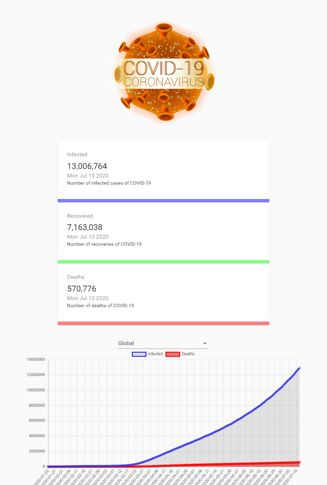

# Coronavirus Tracker Web Application

SITUS UJI COBA - <https://example-covid-19-tracker.netlify.app>

## API 

real-time saya ambil disini - <https://covid19.mathdro.id/api>

## Chart Visualization

Menggunakan chart.js dimana menampilkan line chart dan bar chart
